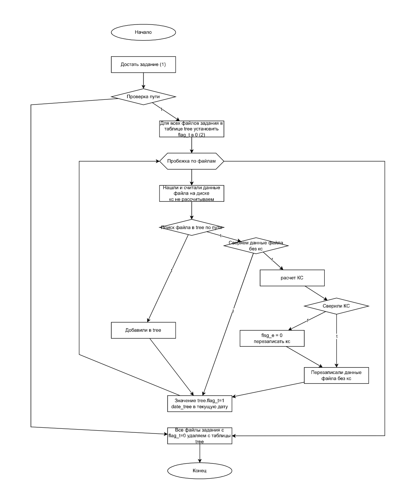
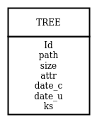

# Парсер репоситориев и архивов
## Содержание репы

| Файл  | Описание файла |
| ------------- | ------------- |
| main.py  | основной файл проекта  |
| README.md  | Документация  |
| requirements.txt | Файл зависимостей необходимых для запуска |
| db.py | Файл обращения к БД|
| img/| Каталог с рисунками |
| .env_example| пример заполнения файла .env |


## Запуск
```bash
 sudo apt install python3-pip
 sudo apt install python3-venv
 sudo apt-get install libmariadb3 libmariadb-dev

 python3 -m venv venv
 source venv/bin/activate
 source .env
 pip install -r requirements.txt
 pythom3 main.py
```

## Структура проекта




## Задачи проекта
получаем на вход 1 параметр

| путь |
| ------------- |
| путь до папки на машине |
| путь до архива на машине |
| путь до файла на машине |

далее проверяется файлы входящие в путь параметра на наличее в бд в таблице tree




поля
|поле бд  | обозначение |
| ------------- | ------------- |
| Id | первичный ключ |
| path | путь до файла |
| size | размер файла в байтах берется из метаданных |
| attr | атрибуты (права доступа и прочее) |
| date_c | дата создания  |
| date_u |  дата последнего изменения |
| ks | контрольная сумма по md5 |
| del | флаг файл удален или нет |
